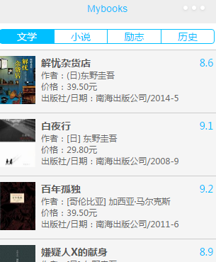

# wx-myBooks
## 功能介绍
1.某类书籍列表展示

2.搜索功能(下拉显示搜索框)

3.Lazy Load(触底时加载更多数据)

4.详细信息展示

5.前进后退功能

***
## 特点：
*是一个单页面应用程序（SPA）
## 单页面应用优缺点
### (1).优点
	1.无刷新更新数据。
	能在不刷新整个页面的前提下与服务器通信维护数据。这使得Web应用程序更为迅捷地响应用户交互，并避免了在网络上发送那些没有改变的信息，减少用户等待时间，带来非常好的用户体验。
	2.异步不阻塞。
	异步方式与请求数据，不需要打断用户的操作，具有更加迅速的响应能力。优化了Browser和Server之间的沟通，减少不必要的数据传输、时间及降低网络上数据流量。
	3.前端和后端负载平衡。
	减轻服务器的负担，可以最大程度的减少冗余请求和响应对服务器造成的负担，提升站点性能。
###	(2).缺点
	1.干掉了Back和History功能。（myBooks中通过添加前进后退功能按钮解决）
	用户通常会希望单击后退按钮能够取消他们的前一次操作。在动态更新页面的情况下，用户无法回到前一个页面状态。
***
## 前进后退功能实现思路
	可以通过创建一个history对象，用于存储记录用户的操作。通过监听用户操作的变化导致的history的变化，控制改变按钮的状态。
	